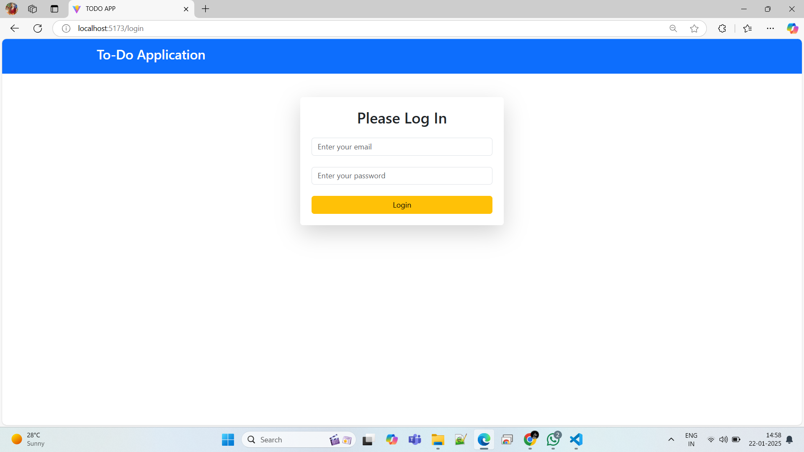
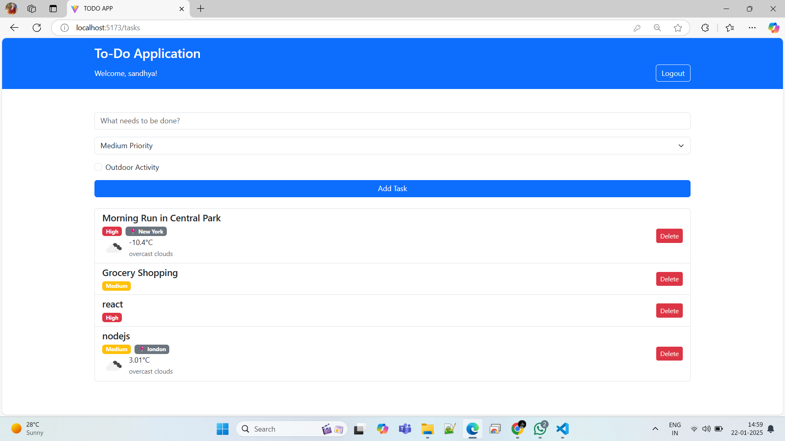

# React + Vite

This template provides a minimal setup to get React working in Vite with HMR and some ESLint rules.

Currently, two official plugins are available:

- [@vitejs/plugin-react](https://github.com/vitejs/vite-plugin-react/blob/main/packages/plugin-react/README.md) uses [Babel](https://babeljs.io/) for Fast Refresh
- [@vitejs/plugin-react-swc](https://github.com/vitejs/vite-plugin-react-swc) uses [SWC](https://swc.rs/) for Fast Refresh


# My Project

This is a description of my project.

## Features
- Feature 1
- Feature 2

## Screenshot



## Installation
1. Clone the repo:
   ```bash

## Install dependencies:
npm install

## Run the app:
npm run dev

## login credentials:
email:- sandhya@gmail.com
password :- password123


